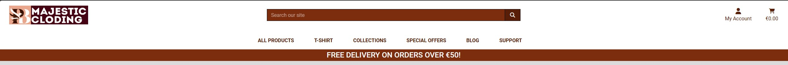
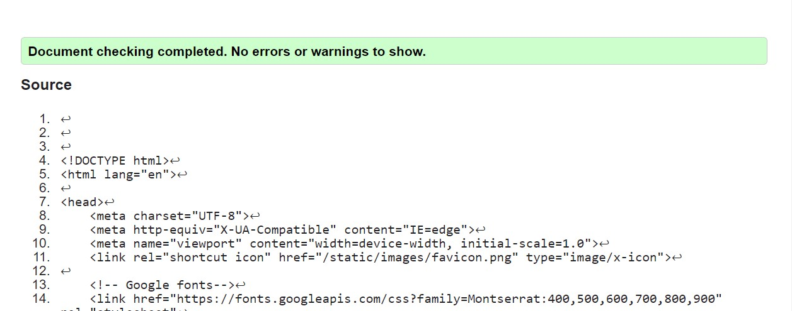

# PB MAJESTIC CLODING - PP5

## Overview

Welcome to the official repository of PB Majestic Clothing, your ultimate destination for high-quality Christian custom t-shirts that blend faith and fashion. We're thrilled to have you here and share our passion for spreading the message of Christ through stylish apparel. This is a B2C e-commerce site to sell christian brands.

### About PB Majestic Clothing

At PB Majestic Clothing, we believe that clothing is not just about fashion; it's also a powerful way to express your faith and devotion. Our brand is dedicated to creating unique and meaningful custom t-shirts that allow you to wear your beliefs proudly. Whether you're looking for eye-catching designs, inspirational quotes, or subtle symbols, our collection has something special for everyone.

## Project Goal

This is my fifth portfolio project for Code Institute, and I hope to demonstrate the abilities I've acquired by doing so. Due to my dream of establishing such an online business, I then decided to use this opportunity to build this for the future.

### Click [Here](https://pb-majestic-cloding-30c8cd3db475.herokuapp.com/) to visit the deployed Site

## UX

As a graphic designer myI intended to make the website quite simple while I was developing it. When trying to convince a user to become a customer, overcomplicating the aesthetic of an online business runs the danger of creating a poor user experience.
It is a business-to-consumer e-commerce site that tends to supply customers with the best quality customised T-shirts with a lot of messages in the christian faith and also be a piece to guide a man in life because of the words in some of the designs.
On visiting the site, user's are greeted with a large image that gives a cleatr introduction of all what the site is about.
All users will be able to browse/sort Products, add to a cart, and checkout. Registered users will be able to add products to their Wishlist, view their Order history, and update/save their delivery information for quicker checkouts. Registered users will also be able to review products and like/comment on Blog posts. Staff will be able to add/edit/delete Products and add/edit/delete Blog Posts without entering admin. Any user reviews can be edited/deleted by Staff if required. When dealing with Products Staff will be able to make a Product a featured Product to be displayed on the Homepage or put a Product on sale. The graphical elements and overall design of the site provide the user with an enjoyable experience with an aesthetically pleasing display.

"Crafting Seamless Shopping Experiences: Our online shop prioritizes user-centric design, seamlessly integrating intuitive 'Add to Cart' and 'Remove' interactions that enhance product exploration. We elevate convenience by streamlining the 'Place Order' process, ensuring a frictionless journey from selection to purchase. Your personalized 'User Profile' area empowers you, putting control at your fingertips, and making every visit a delightful and efficient engagement." The User Profile gives easily access and update your profile information, keep track of your orders, and curate your wishlist for a personalized and convenient shopping journey

"Seamlessly shop a curated collection of products and explore enriching Christian blogs, all in one platform. Experience the convenience of user reviews for informed decisions, while engaging in meaningful discussions through interactive comment sections. Elevate your online journey with us, where shopping meets spirituality."

## Agile planning

This project was developed using agile methodologies by delivering small features across the duration of the project. All User Stories were assigned to Epics, prioritized under the labels, Must Have, Should Have, and Could Have. They were assigned story points according to complexity. The Fibonacci sequence is employed for the Story points. "Must Have" stories were completed first, "Should Have's" and then finally "Could Have's". It was done this way to ensure that all core requirements were completed first to give the project a complete feel. In some scenarios, certain "Should Have's" were implemented before schedule due to the nature of the implementation i.e. some Product related "Should Have's" were done during Product development with some "Must Have's" - Error templates developed later on. The Kanban board was created using Github projects user/developer stories and also a list of Acceptance criterias and Task

## User Stories

### EPIC 1: Initial Django Setup

- As a Developer I can set up Django and install the supporting libraries predicted to be needed so that I am ready to start development
- As a Developer I need to create the env.py and add to .gitignore so that I can securely deploy the site without exposing developer keys/information

### Epic 2: UX/UI Design

- As a Developer I can build a base template so that it can be extended to any templates that may require it.
- As a Developer I can design an aesthetically pleasing Homepage so that users have a positive experience when visiting the site.
- As a Developer I can implement message toasts so that the user/customer is alerted when they carry out and action or encounter and error.

### EPIC 3: Authorization and Authentication

- As a site user I want to be able to create an account on the site so that I can save my billing and shipping details and see a history of my purchases on my account.
- As a registered site user I want to be able to add products to a wish list so that I can keep a collection of items I am interested in buying in the future.
- As a registered user I want to be able to edit the details saved to my account so that I can keep my details up to date.

### Epic 4: Homepage/Site Navigation

- As a first-time site visitor I want to be able to clearly see what the site's purpose is so that I can decide whether or not to continue browsing it.
- As a user I want to be able to easily navigate the website so that I can find the content I'm looking for.
- As a site user I want to be able to search the website so that I can find specific products and see if the site has them in stock.
- As a site user I want to be able to contact the site owners so that I can request further information about the site or lodge a complaint.

### EPIC 5: Products Setup (CRUD)

- As a Developer I can create functional code to apply Products to my site so that the customer has Products to purchase
- As a User I would like the ability to search for a product so that to see if the site sells it
- As a User I would like to view a page containing the search results from my Product search so that so that I can find my prefered Product or see similar Products
- As a User I would like a page that displays All Products the site offers so that I can browse and find products that I may want to purchase
- As a User I would like the ability to sort products so that I can identity the best priced Products the site offers #31
- As a Developer I can allow the functionality to edit Products by staff members so that they can reduce/increase prices, change product descriptions/images etc
- As a Developer I can add functionality for staff members to delete Products so that if they do not sell or there is problems with the Product it can be removed from the storefront
- As a User I would like to view the details of any Product so that I can see if the Product has the required specifications that I need/want

### EPIC 6: Purchase / Checkout

- As a site user I want to be able to add products to my shopping basket so that I can proceed to the checkout and purchase them.
- As a site user I want to be able to see a running total of the items in my basket so that I can manage my spending and know what to expect at the checkout.
- As a site user I want to be able to checkout with a card payment so that I can place an order for the items in my basket.
- As a site user I want to be able to receive an order confirmation email after I purchase from the shop so that I can have a record of what I've purchased in my email inbox.
- As a site user I want to be able to apply discount codes in the checkout so that I can receive a discount on my purchase.

### EPIC 7: Stripe Setup - Purchase / Checkout

As a Developer I can implement Stripe so that it can manage payments for the site products at checkout #46

### EPIC 8: User Profile (CRUD)

- As a customer I would like the ability to create my own Profile page so that I can save my shipping address for future purchases and track my orders
- As a Developer I can implement functionality to allow a customer to save information to a personal Profile so that they can save information i.e. shipping address/orders for future review
- As a customer I would like to add wishlish items to show in my profile so that I can get easy access to view and purchase them.

# EPIC 9: Blog

- As a site user I want to be able to view blog posts on the website so that I can read any posts I feel are relevant to me.
- As a site user I want to be able to add, edit and delete comments on blog so that I can share my view on the blog post.
- As a site admin I want to be able to create blog posts from the front end so that I can share information with site visitors.
- As a site admin I want to be able to edit existing blog posts so that I can ensure that posts are up to date and relevant without having to create them from scratch in case of error.
  As a site admin I want to be able to delete existing blog posts so that I can remove any unwanted posts from the site.

### EPIC 10: Review Products (CRUD)

- As a Customer I would like to leave a review on a Product so that my fellow shoppers can benefit from my feedback and make informed purchasing decisions.
- As a Developer I can build a page to display the Review form so that customer has the ability to write their review and submit it.

### EPIC 11: Contact Us #15

- As a Developer I can add functionality to allow the customer to contact the site owner so that any issue they encounter can be logged and resolved
- As a user/customer I should be able to contact the site owner so that I have a comminucation if any issue arises

### EPIC 12: SEO & Web Marketing #13

- As a Developer I can create a Facebook business page for my site so that I can market my website on the social platform #60
- As a Developer I can implement a newsletter on my site so that customers can subscribe for future updates and deals which should bring them back to the site for future purchases.
- As a Developer I can add helpful description and keywords so that my site can reach a wider audience

### EPIC 13: Error Notification

- As a Developer I can implement a 403 error page to redirect unauthorised users so that I can secure my views.
- As a Developer I can implement a 404 error page so that I can alert users when they have accessed a page that doesn't exist.
- As a Developer I can implement a 500 error page so that I can alert users when an internal server error occurs.

### EPIC 14:

As a User, I must be able to be notified with messages, so that I would know if my request is successful.

### EPIC 15: Documentation

- Create/Write README.md
- Create/Write TESTING.md

## Wireframe

To help with the design of the site, I created wireframes for each page. To follow best practice, wireframes were developed for mobile, tablet, and desktop sizes. I've used Balsamiq to design my site wireframes.

### Sketches

Click to view

## The Scope Plane

- Responsive Design - The site should be fully functional on all devices from 320px up
  Hamburger menu for mobile devices
- Ability to perform CRUD functionality on Products, Profiles, Reviews, Blog Posts, and Comments
- Restricted features for registered users such as Product reviewing, adding Products to Wishlist, editing Profiles, and Commenting/Liking Blog posts.
- Newsletter Subscribing

# Database Design

I created an entity relationship diagram using [sqldbm](https://app.sqldbm.com/CreateNew/). This helped me to visualize the relationships between my data structures and made the development process easier as I had everything mapped out in front of me for reference to avoid having to reference each models.py file individually.

## Features

### Home Page

### Navbar with Search field and nav links

### Footer with Newletter

### All Products

### All Products Details

## Product reviews

- No review on product page
  

- Add product review forms
  

- Edit product review forms
  

- Delete product review forms
  

### Product Management

- Add Products
  

- Edit Products
  

- Edit Products
  

### Cart

### Checkout

### Order Completion

### User Profile

- Detail Profile
  

- Orders on Profile
  

- Wishlist on Profile
  

### Blog

- Blog view
  

- Blog Add
  

- Blog Edit
  

- Blog Delete
  

- Blog comment
  

- Blog edit comment
  

- Blog delete
  

### Contact Us

### Status Error Templates

As a Developer I can implement a 403 error page to redirect unauthorised users so that I can secure my views

As a Developer I can implement a 404 error page so that I can alert users when they have accessed a page that doesn't exist

As a Developer I can implement a 500 error page so that I can alert users when an internal server error occurs

A 403 error page has been implemented to provide feedback to the user when they try to access unauthorized content. Users will be directed to this page if they alter the URLs and attempt to edit, delete, or access pages that are restricted.

A 404 page has been implemented and will display if a user navigates to a broken link.
The 404 page will allow the user to easily navigate back to the main website if they direct to a broken link / missing page, without the need for the browser's back button.

A 500 error page has been displayed to alert users when an internal server error occurs. The message relays to users that the problem is on our end, not theirs.

### User Sign Up

Users without an account can register for one through the register link in the main nav menu. This will present them with a form to add their details and created a profile for that user on completion.
Users are sent a confirmation email to complete their account sign up to help avoid people from creating spam accounts on the site.

### User Sign In

If a user isn't signed in to the site but has a profile, they can follow the sign in link where they're presented with a log in page. They must input their username or email address and correct password to do so. There's also a checkbox to let the user be remembered on their current device to avoid having to log in every time they visit the site.
There's a link for users who have forgotten their password.

### User Sign Out

If a user wants to end their logged in session, they can click logout under the account dropdown in the nav menu.
This will bring them to a page confirming they want to log out.

### Password Reset

If a user is trying to log in and has forgotten their password they can visit the password reset page. Here a user must enter their email address they used to sign up with and an email will be sent to them with further instructions on resetting their password to regain access to their account.

## Tools & Technologies Used

This site couldn't have been created without a variety of tools and technologies. I've listed the ones used below.

- HTML used for the main site content.
- CSS used for the main site design and layout.
- CSS :root variables used for reusable styles throughout the site.
- CSS Flexbox used for an enhanced responsive layout.
- JavaScript used for user interaction on the site.
- Python used as the back-end programming language.
- Git used for version control. (git add, git commit, git push)
- GitHub used for secure online code storage.
- Gitpod used as a cloud-based IDE for development.
- Bootstrap used as the front-end CSS framework for modern responsiveness and pre-built components.
- Django used as the Python framework for the site.
- PostgreSQL used as the relational database management.
- ElephantSQL used as the Postgres database.
- Heroku used for hosting the deployed back-end site.
- Stripe used for online secure payments of ecommerce products/services.
- AWS S3 used for online static file storage.
- Django Summernote used for the body field for blog posts.
- Pillow used for handling images.

## Marketing Strategy

Social Media Marketing
A Facebook Business page has been created and deployed. Creating a strong social media campaign and linking back to the site can help drive sales and build a community. I have included links to the site on the Facebook page and have added a post including information about the site/free delivery threshold.

## Newsletter Marketing

I used Mailchimp to set up a newsletter sign-up embedded form on my site, to allow users to supply their email addresses if they are interested in learning more about the site and to drive repeat business. An automated Welcome email campaign was created so that when a user subscribes they will receive an email sent from Mailchimp thanking them for subscribing. Following this I have created a Newsletter campaign which will be manually initiated by the site owner and each subscriber will receive the Newsletter. The hope is to build a community which in turn might lead to returning/new customers and lead to more business.

## Search Engine Optimization (SEO)

Keywords
I utilized Wordtracker to identify keywords that align with my site. The keywords chosen have high enough volume and low enough competition, the KEI (Keyword Effectiveness Index) metric on Wordtracker was used to help decide on the best keywords.

# Testing

Validator Testing

### HTML Validator:

As this project uses Django templates the html has been validated by manually clicking through the application pages, copying the source of the rendered pages and then validating this version of the html using the W3C Validator [Link](https://validator.w3.org/). To validate the HTML files all Django template tags were manually removed with the HTML code copied and inserted to the base template, including manually pasting in navigation and footer templates into all page testing.

### PEP 8 Python Linter:

PEP 8 Online linter [Python validator](https://pep8ci.herokuapp.com/#). The code passed without any errors on all files tested:

**Models**

### Javascript Validator:

JSHint was used to validate the JavaScript with no errors highlighted.

### CSS Validator:

The W3C CSS Validator Services were used to validate the CSS to ensure there were no errors. There was one warning that read: "Imported style sheets are not checked in direct input and file upload modes", which is fine as it's referring to a Google fonts import.

## Lighthouse Report

Lighthouse report showed areas for improvement on SEO and Best practices. Meta descriptions and keywords were added to boost the SEO to 100 but the best practice warnings were coming from the use of an embedded iframe's javascript. Unfortunately I did not find a way to improve this as I am not initialising the google map iframe with javascript.

## Responsiveness

The Website has been tested and it passed responsiveness for small mediumum and large screens of various devices. All pages have been tested for with a device size of from 320px.

The Responsive design was tested manually with [Chrome DevTools](https://developer.chrome.com/docs/devtools/) and also the Microsoft Dev tools. The Website worked perfectly well.

The Website pass its responsiveness and no responsive issues were seen on the following trial device:

- iPhone SE
- iPhone 12 Pro
- Samsung Galaxy S20/S20 Ultra
- Surface Duo

## Deployment

The live deployed application can be found deployed on Heroku.

## ElephantSQL Database

This project uses ElephantSQL for the PostgreSQL Database.

To obtain your own Postgres Database, sign-up with your GitHub account, then follow these steps:

- Click Create New Instance to start a new database.
- Provide a name (this is commonly the name of the project: pb-majestic-cloding).
- Select the Tiny Turtle (Free) plan.
- You can leave the Tags blank.
- Select the Region and Data Center closest to you.
- Once created, click on the new database name, where you can view the database URL and Password.

### Amazon AWS

This project uses AWS to store media and static files online, due to the fact that Heroku doesn't persist this type of data.

Once you've created an AWS account and logged-in, follow these series of steps to get your project connected. Make sure you're on the AWS Management Console page.

### S3 Bucket

- Search for S3.

- Create a new bucket, give it a name (matching your Heroku app name), and choose the region closest to you.

- Uncheck Block all public access, and acknowledge that the bucket will be public (required for it to work on Heroku).

- From Object Ownership, make sure to have ACLs enabled, and Bucket owner preferred selected.

- From the Properties tab, turn on static website hosting, and type index.html and error.html in their respective fields, then click Save.

- From the Permissions tab, paste in the following CORS configuration:

- Copy your ARN string.

- From the Bucket Policy tab, select the Policy Generator link, and use the following steps:

- Policy Type: S3 Bucket Policy

- Effect: Allow

- Principal: \*

- Actions: GetObject

- Amazon Resource Name (ARN): paste-your-ARN-here

- Click Add Statement

- Click Generate Policy

- Copy the entire Policy, and paste it into the Bucket Policy Editor

- Before you click "Save", add /\* to the end of the Resource key in the Bucket Policy Editor (like above).

- Click Save.

- From the Access Control List (ACL) section, click "Edit" and enable List for Everyone (public access), and accept the warning box.

- If the edit button is disabled, you need to change the Object Ownership section above to ACLs enabled (mentioned above).

## IAM

Back on the AWS Services Menu, search for and open IAM (Identity and Access Management). Once on the IAM page, follow these steps:

- From User Groups, click Create New Group.
- Suggested Name: group-pb-majestic-cloding (group + the project name)
- Tags are optional, but you must click it to get to the review policy page.
- From User Groups, select your newly created group, and go to the Permissions tab.
- Open the Add Permissions dropdown, and click Attach Policies.
- Select the policy, then click Add Permissions at the bottom when finished.
- From the JSON tab, select the Import Managed Policy link.
- Search for S3, select the AmazonS3FullAccess policy, and then Import.
- You'll need your ARN from the S3 Bucket copied again, which is pasted into "Resources" key on the Policy.
- Click Review Policy.

- Suggested Name: policy-pb-majestic-cloding (policy + the project name)

- Provide a description:
  "Access to S3 Bucket for pb-majestic-cloding static files."
  Click Create Policy.

- From User Groups, click your "group-pb-majestic-cloding".
- Click Attach Policy.
- Search for the policy you've just created ("policy-pb-majestic-cloding") and select it, then Attach Policy.
- From User Groups, click Add User.
- Suggested Name: user-pb-majestic-cloding (user + the project name)
- For "Select AWS Access Type", select Programmatic Access.
- Select the group to add your new user to: group-pb-majestic-cloding
- Tags are optional, but you must click it to get to the review user page.
- Click Create User once done.
- You should see a button to Download .csv, so click it to save a copy on your system.
- IMPORTANT: once you pass this page, you cannot come back to download it again, so do it immediately!
- This contains the user's Access key ID and Secret access key.
- AWS_ACCESS_KEY_ID = Access key ID
- AWS_SECRET_ACCESS_KEY = Secret access key

### Final AWS Setup

- If Heroku Config Vars has DISABLE_COLLECTSTATIC still, this can be removed now, so that AWS will handle the static files.
- Back within S3, create a new folder called: media.
- Select any existing media images for your project to prepare them for being uploaded into the new folder.
- Under Manage Public Permissions, select Grant public read access to this object(s).
- No further settings are required, so click Upload.

### Stripe API

This project uses Stripe to handle the ecommerce payments.

Once you've created a Stripe account and logged-in, follow these series of steps to get your project connected.

- From your Stripe dashboard, click to expand the "Get your test API keys".
- You'll have two keys here:
- STRIPE_PUBLIC_KEY = Publishable Key (starts with pk)
- STRIPE_SECRET_KEY = Secret Key (starts with sk)
  As a backup, in case users prematurely close the purchase-order page during payment, we can include Stripe Webhooks.

- From your Stripe dashboard, click Developers, and select Webhooks.
- From there, click Add Endpoint.
- https://pb-majestic-cloding.herokuapp.com/checkout/wh/
- Click receive all events.
- Click Add Endpoint to complete the process.
- You'll have a new key here:
- STRIPE_WH_SECRET = Signing Secret (Wehbook) Key (starts with wh)

## Gmail API

This project uses Gmail to handle sending emails to users for account verification and purchase order confirmations.
Once you've created a Gmail (Google) account and logged-in, follow these series of steps to get your project connected.

- Click on the Account Settings (cog icon) in the top-right corner of Gmail.
- Click on the Accounts and Import tab.
- Within the section called "Change account settings", click on the link for Other Google Account settings.
- From this new page, select Security on the left.
- Select 2-Step Verification to turn it on. (verify your password and account)
- Once verified, select Turn On for 2FA.
- Navigate back to the Security page, and you'll see a new option called App passwords.
- This might prompt you once again to confirm your password and account.
- Select Mail for the app type.
- Select Other (Custom name) for the device type.
- Any custom name, such as "Django" or retro-reboot
- You'll be provided with a 16-character password (API key).
- Save this somewhere locally, as you cannot access this key again later!
- EMAIL_HOST_PASS = user's 16-character API key
- EMAIL_HOST_USER = user's own personal Gmail email address

## Heroku Deployment

This project uses Heroku, a platform as a service (PaaS) that enables developers to build, run, and operate applications entirely in the cloud.

Deployment steps are as follows, after account setup:

- Select New in the top-right corner of your Heroku Dashboard, and select Create new app from the dropdown menu.
- Your app name must be unique, and then choose a region closest to you (EU or USA), and finally, select Create App.
- From the new app Settings, click Reveal Config Vars, and set your environment variables.
- Heroku needs two additional files in order to deploy properly.
  - Crequirements.txt
  - Procfile
- You can install this project's requirements (where applicable) using:
- pip3 install -r requirements.txt
- If you have your own packages that have been installed, then the requirements file needs updated using:

- pip3 freeze --local > requirements.txt
- The Procfile can be created with the following command:

  - echo web: gunicorn app_name.wsgi > Procfile
  - replace app_name with the name of your primary Django app name; the folder where settings.py is located

For Heroku deployment, follow these steps to connect your own GitHub repository to the newly created app:

Either:

- Select Automatic Deployment from the Heroku app.
  Or:

- In the Terminal/CLI, connect to Heroku using this command: heroku login -i
- Set the remote for Heroku: heroku git:remote -a app_name (replace app_name with your app name)
- After performing the standard Git add, commit, and push to GitHub, you can now type:
- git push heroku main
- The project should now be connected and deployed to Heroku!

## Cloning

You can clone the repository by following these steps:

1. Go to the GitHub repository
2. Locate the Code button above the list of files and click it
3. Select if you prefer to clone using HTTPS, SSH, or GitHub CLI and click the copy button to copy the URL to your clipboard
4. Open Git Bash or Terminal
5. Change the current working directory to the one where you want the cloned directory
6. In your IDE Terminal, type the following command to clone my repository:
   - git clone https://github.com/adamgilroy22/retro-reboot.git
7. Press Enter to create your local clone.
   Alternatively, if using Gitpod, you can click below to create your own workspace using this repository.

Please note that in order to directly open the project in Gitpod, you need to have the browser extension installed. A tutorial on how to do that can be found here.

## Forking

By forking the GitHub Repository, we make a copy of the original repository on our GitHub account to view and/or make changes without affecting the original owner's repository. You can fork this repository by using the following steps:

1. Log in to GitHub and locate the GitHub Repository
2. At the top of the Repository (not top of page) just above the "Settings" Button on the menu, locate the "Fork" Button.
3. Once clicked, you should now have a copy of the original repository in your own GitHub account!

## Credits

1. Code Institute Template
   This repository was created using the template provided by Code Institute. Also, without the knowledge gained through the coursework, I would not be able to create this site so thank you Code Institute.

2. Django Documentation
   Thanks to the Django docs which were also used as a step-by-step while going through the project to ensure everything was set up correctly.

3. Allauth Documentation
   Thanks to the Alluath documentation which was referenced during development.

4. Stackoverflow
   I found myself on Stackoverflow so many times researching issues. This a fantastic place to learn and troubleshoot code.

5. Slack
   The Slack community is great and I reached out to fellow students who had already completed their P5 for their advice and got some nice tips and feedback. I attended some webinars by CI staff which I found very beneficial.

# Acknowledgements

- To my mentor Daisy Mc Girr, Daisy always goes above and beyond. Even outside of project planning she is great for advice and is a great help to the Slack community too. Daisy became my Mentor midway through P2 and has been amazing to deal with, she is a great credit to CI and the whole community.

- Also a big one goes to my wife for the support and helping the kids throughout eventhough it was not an easy journey
