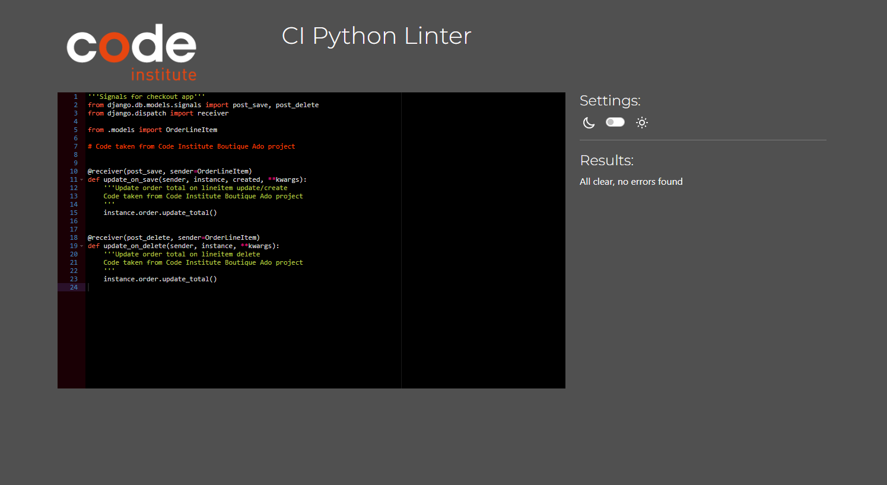
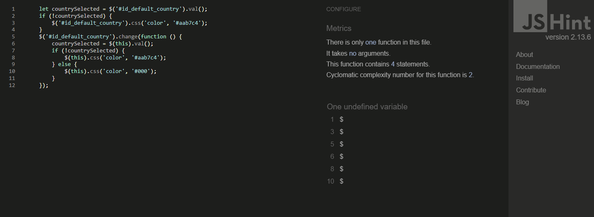

# Testing

Back to [README.md](README.md)

## Validator Testing

### HTML Validator:

Since this project employs Django templates, the HTML validation process involved a manual verification procedure. This entailed navigating through the application pages, duplicating the source code of the displayed pages, and subsequently validating this HTML rendition using the W3C Validator [Link](https://validator.w3.org/). To ensure the HTML files were validated correctly, all Django template tags were meticulously eliminated. The HTML code was then extracted and integrated into the base template, and the navigation and footer templates were manually added to all pages during testing.

### PEP 8 Python Linter:

The PEP 8 Python Linter by CI was used to test the validity of the python code. [PEP( PYTHON CI LINTER](https://pep8ci.herokuapp.com/) Below are the results of the test.

| FILE                           | IMAGE                                                            | REMARK                                                                            |
| ------------------------------ | ---------------------------------------------------------------- | --------------------------------------------------------------------------------- |
| Blog - admin.py                |                        | No Errors detected - PASS                                                         |
| Blog - forms.py                |                        | No Errors detected - PASS                                                         |
| Blog - models.py               |                       | No Errors detected - PASS                                                         |
| Blog - views.py                |                        | No Errors detected - PASS                                                         |
| Blog - widgets.py              |                     | No Errors detected - PASS                                                         |
| Cart - context.py              |                    | No Errors detected - PASS                                                         |
| Cart - views.py                |                         | No Errors detected - PASS                                                         |
| Checkout - admin.py            |                      | No Errors detected - PASS                                                         |
| Checkout - forms.py            |                      | No Errors detected - PASS                                                         |
| Checkout - models.py           |                    | No Errors detected - PASS                                                         |
| Checkout - signals.py          |                  | No Errors detected - PASS                                                         |
| Checkout - views.py            |                       | No Errors detected - PASS                                                         |
| Checkout - webhooks-handler.py |  | No Errors detected - PASS                                                         |
| Checkout - webhook.py          |               | No Errors detected - PASS Just a long code error which does not affected the code |
| Contact - admin.py             |                  | No Errors detected - PASS                                                         |
| Contact - contact.py           |                  | No Errors detected - PASS                                                         |
| Contact - models.py            |                | No Errors detected - PASS                                                         |
| Contact - views.py             |                  | No Errors detected - PASS                                                         |
| Product - admin.py             |                      | No Errors detected - PASS                                                         |
| Product - forms.py             |                      | No Errors detected - PASS                                                         |
| Product - models.py            |                    | No Errors detected - PASS                                                         |
| Product - views.py             |                      | No Errors detected - PASS                                                         |
| Product - widgets.py           |                  | No Errors detected - PASS                                                         |
| Profile - admin.py             |                  | No Errors detected - PASS                                                         |
| Profile - forms.py             |                  | No Errors detected - PASS                                                         |
| Profile - models.py            |                | No Errors detected - PASS                                                         |
| Profile - views.py             |                  | No Errors detected - PASS                                                         |
| Home - views.py                |                               | No Errors detected - PASS                                                         |

### Javascript Validator:

JSHint was used to validate the JavaScript with no errors highlighted. There were some few issues raised but does not affect the functionality of the website in anyway.

| FILE            | IMAGE                                               |
| --------------- | --------------------------------------------------- |
| Countryfield.js |  |
| Quantity.js     |          |
| Stripe.js       |             |

### CSS Validator:

The CSS files within the project were all checked for errors using W3C CSS Validator Services. They all passed the text and displayyed the same message. The CSS files are blog.css , checkout.css and profile.css

## Lighthouse Report

The Lighthouse report indicated areas where SEO and best practices could be enhanced. We improved the SEO score to 100 by incorporating meta descriptions and keywords. However, we encountered best practice warnings due to the utilization of JavaScript within an embedded iframe.

| FILE               | IMAGE                                                  |
| ------------------ | ------------------------------------------------------ |
| All products       |         |
| Product details    |          |
| Product Management |  |
| Blog Post          |                       |
| Blog post details  |         |
| Cart               |                       |
| Checkout           |               |
| Profile            |                 |

## Responsiveness

The Website has been tested and it passed responsiveness for small mediumum and large screens of various devices. All pages have been tested for with a device size of from 320px.

The Responsive design was tested manually with [Chrome DevTools](https://developer.chrome.com/docs/devtools/) and also the Microsoft Dev tools. The Website worked perfectly well.

The Website pass its responsiveness and no responsive issues were seen on the following trial device:

- iPhone SE
- iPhone 12 Pro
- Samsung Galaxy S20/S20 Ultra
- Surface Duo

## User Story Test

Several Test were conducted to test the full functionality of the site in reference to the User stories. The following table give full details of the out of the test. These are for the main features of the site.

| PAGE                               | ACTION / EXPECTATIONS                                                                     | PASS / FAIL |
| ---------------------------------- | ----------------------------------------------------------------------------------------- | ----------- |
| Homepage                           |                                                                                           |             |
|                                    | Navigate to Homepage by clicking the Logo                                                 | PASS        |
|                                    | Navigate to All products page by clicking the SHOP NOW button                             | PASS        |
|                                    | Display footer with Social link and Newsletter                                            | PASS        |
|                                    | Social link should open a new tab when clicked                                            | PASS        |
|                                    |                                                                                           |             |
| All Product Page                   |                                                                                           |             |
|                                    | Display all products in the database                                                      | PASS        |
|                                    | Display a search bar to search for products                                               | PASS        |
|                                    | Display a sort by dropdown to sort products by price, rating and category                 | PASS        |
|                                    | Display a product image, name, price and rating                                           | PASS        |
|                                    | Click back to top button to return to top of page                                         | PASS        |
|                                    | Click on product image or the view product button to view product details                 | PASS        |
|                                    | Display Add to wishlist for only logged in users                                          | PASS        |
|                                    | Add product to wishlish when user click on the Add to wishlist button                     | PASS        |
|                                    |                                                                                           |             |
| Product Detail Page                |                                                                                           |             |
|                                    | Display product details, Price and category                                               | PASS        |
|                                    | Display product qunatity selector                                                         | PASS        |
|                                    | Click on + to increase quantity and - to decrease                                         | PASS        |
|                                    | Quantity ranges from 1 to 99                                                              | PASS        |
|                                    | Click on Add to Cart to add product to basket                                             | PASS        |
|                                    | Display Add to wishlist button for only logged in users                                   | PASS        |
|                                    | Display Add and delete product for only Superusers and Staff                              | PASS        |
|                                    | Display status of stock                                                                   | PASS        |
|                                    | If out of stock, Add to cart will not display                                             | PASS        |
|                                    | Display product review from user and other users                                          | PASS        |
|                                    | Anonymous user can only view reviews but can't write review on products                   | PASS        |
|                                    | Anonymous user sis redirected to log in or sign up in an attempt to write review          | PASS        |
|                                    |                                                                                           |             |
| Cart Page                          |                                                                                           |             |
|                                    | Navigate to Cart page by clicking the Cart icon                                           | PASS        |
|                                    | Display all products in cart with option to update quantity or remove product             | PASS        |
|                                    | Display back to shop button                                                               | PASS        |
|                                    | Click on secure checkout to proceed to payment                                            | PASS        |
|                                    |                                                                                           |             |
| Checkout Page                      |                                                                                           |             |
|                                    | Display Cart details                                                                      | PASS        |
|                                    | Display Cart total                                                                        | PASS        |
|                                    | Display Cart subtotal                                                                     | PASS        |
|                                    | Display Cart delivery                                                                     | PASS        |
|                                    | Display Cart grand total                                                                  | PASS        |
|                                    | Display Checkout form                                                                     | PASS        |
|                                    | Attempts to leave require fields empty raise an error                                     | PASS        |
|                                    | Display Delivery details                                                                  | PASS        |
|                                    | Display Payment details                                                                   | PASS        |
|                                    | Invalid card details raise an error                                                       | PASS        |
|                                    | Order complete after all field required filled and valid card details provided            | PASS        |
|                                    |                                                                                           |             |
| Checkout Success                   |                                                                                           |             |
|                                    | Order conpleted and redirects to success page                                             | PASS        |
|                                    | Click Back to profile to navigate to profile page                                         | PASS        |
|                                    | Click Back to shop to navigate to all products page                                       | PASS        |
|                                    | Click Home to navigate to Homepage                                                        | PASS        |
|                                    |                                                                                           |             |
| Product Management - For Staffs    |                                                                                           |             |
|                                    | Navigate to Add product page from the dropdown on the main navbar account icon            | PASS        |
|                                    | Add product forms displays to be filled                                                   | PASS        |
|                                    | Click cancel to return to all products                                                    | PASS        |
|                                    | Add product and get redirected to product added details                                   | PASS        |
|                                    | Click edit link on individual products to edit product details                            | PASS        |
|                                    | Click delete link on individual products to delete product from database                  | PASS        |
|                                    |                                                                                           |             |
| Contact Page                       |                                                                                           |             |
|                                    | Navigate to contact page from support dropdown on manin navbar                            | PASS        |
|                                    | All field are required to be filled                                                       | PASS        |
|                                    | Uncompleted forms raise validation error                                                  | PASS        |
|                                    | Successfully sent form raise a success message                                            | PASS        |
|                                    | Customer recieves a successfully sent form email confirmation                             | PASS        |
|                                    |                                                                                           |             |
| Authentications and Authorisations |                                                                                           |             |
|                                    | Sign UP                                                                                   |             |
|                                    | Click on Register button under account on nav menu                                        | PASS        |
|                                    | Enter valid email address                                                                 | PASS        |
|                                    | Enter valid password two time, unmatched passwords raise an error                         | PASS        |
|                                    | Click Sign Up button on sign up page and receive a verification email to activate account | PASS        |
|                                    | Click on Register button under account on nav menu                                        | PASS        |
|                                    | Log In                                                                                    |             |
|                                    | Click on the Login button under account on nav menu                                       | PASS        |
|                                    | Enter valid email address and password                                                    | PASS        |
|                                    | Click forget password to redirect to password reset                                       | PASS        |
|                                    | with valid email and password, click on sign in to access user account                    | PASS        |
|                                    | Sign out                                                                                  |             |
|                                    | Click on the Logout from the account dropdown on the main navbar                          | PASS        |
|                                    | Confirm sign out by clicking sign out on the confirmation page.                           | PASS        |
|                                    | Click cancel to return to Homepage                                                        | PASS        |
|                                    |                                                                                           |             |
| User Profile                       |                                                                                           |             |
|                                    | Click on the my profile under account on nav menu                                         | PASS        |
|                                    | Navigate on the right to display profile details, order history and wishlist              | PASS        |

## Toast
There is a message alert that allows the user to see if they have successfully signed up, login and logout.
There are also alert that communicate to the user in various operations.

| ACTION | PASS/FAIL |
| :--- | :--- |
| When a product is added to the Cart | PASS |
| When a product is removed from the Cart | PASS |
| When a product is added to the wishlist | PASS |
| When a product is removed from the wishlist | PASS |
| When the wishlist is cleared from all products | PASS |
| When a product is update in the Cart | PASS |
| When a product review is added | PASS |
| When a customer like or comment on a blog | PASS |
| When a product is edited or removed by a staff | PASS |
| When an order is completed | PASS |
| When error and warning are raised | PASS |